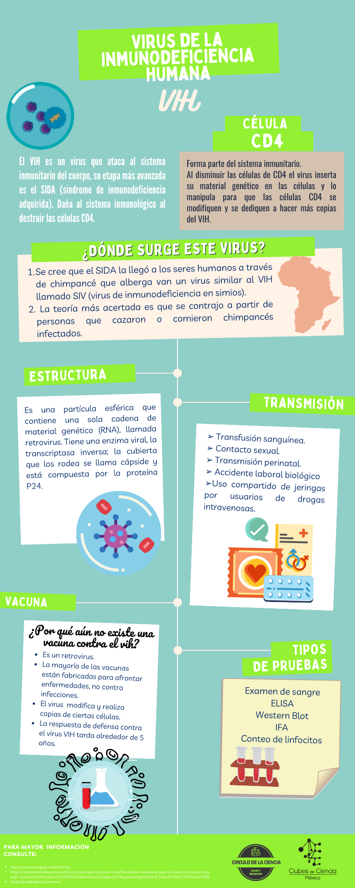
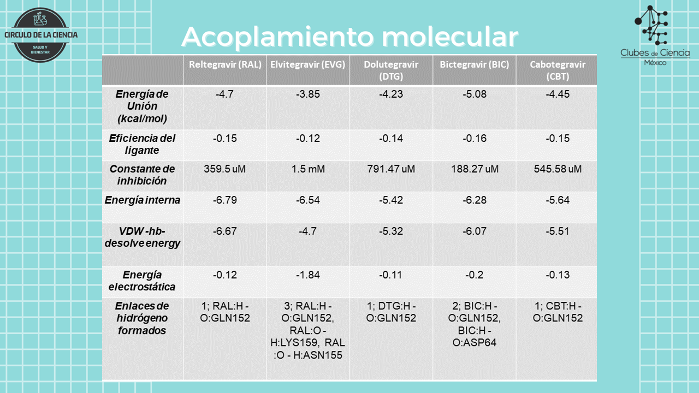
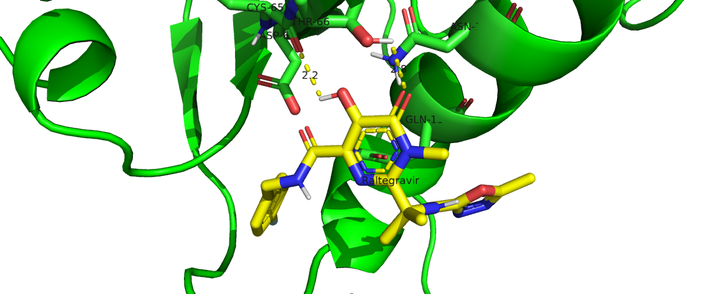
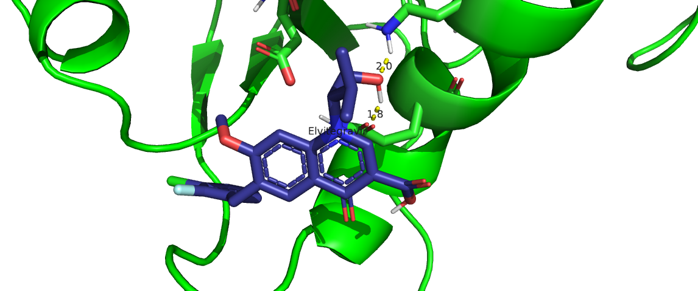
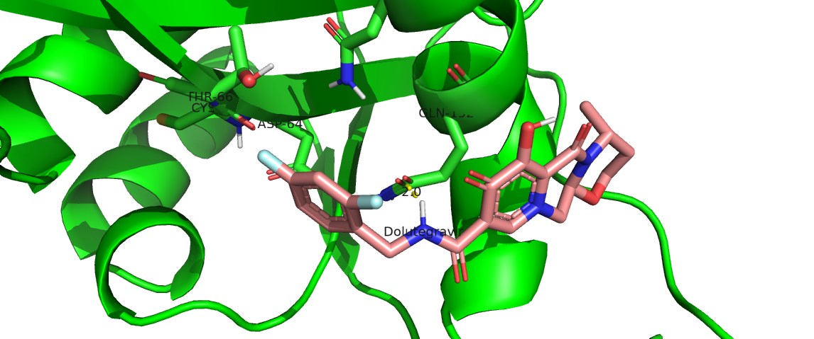
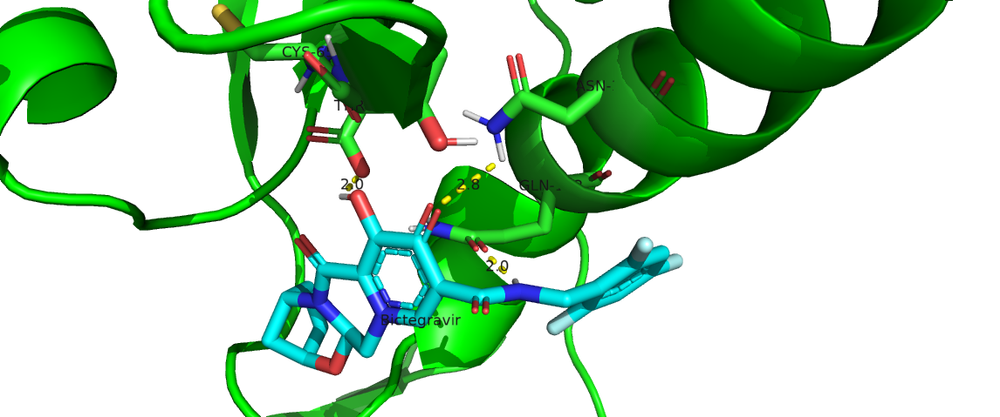
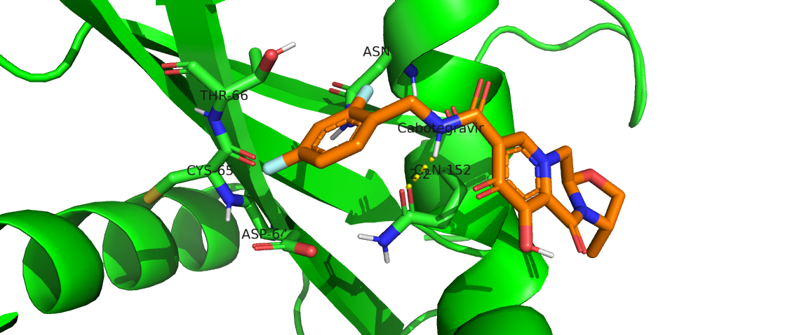
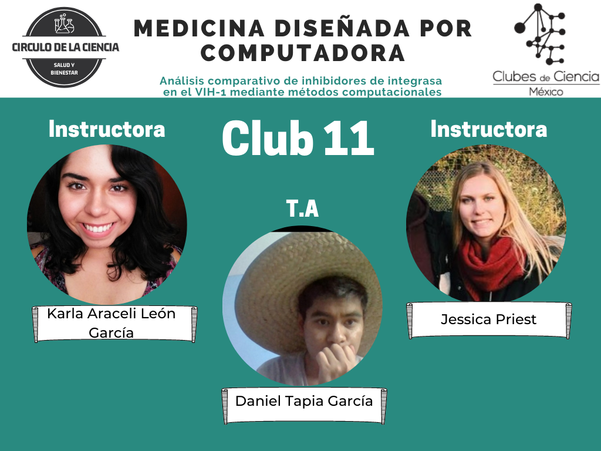
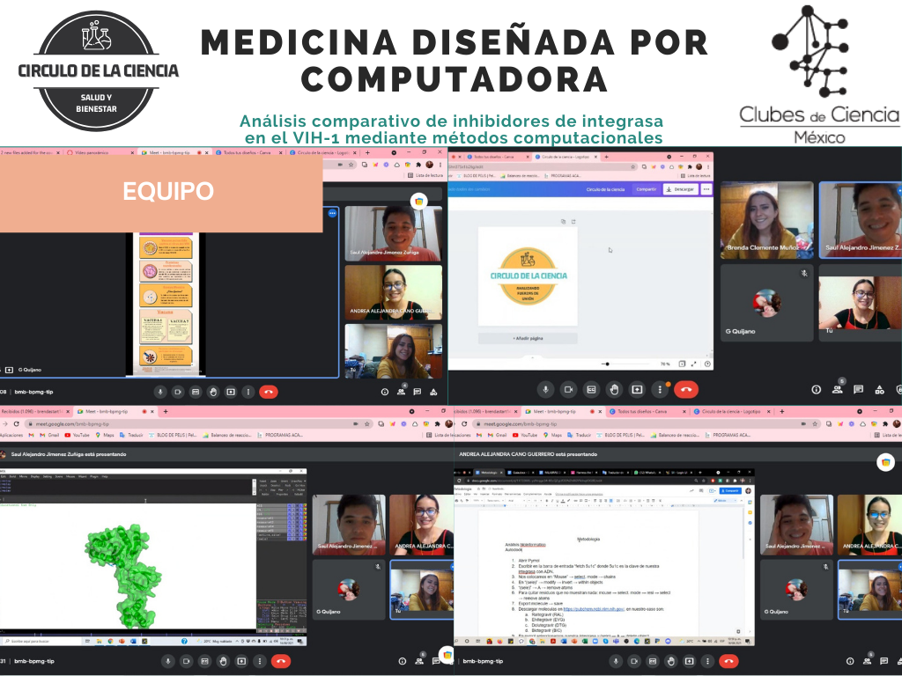

## ANÁLISIS COMPARATIVO DE INHIBIDORES DE INTEGRASA EN EL VIH-1 MEDIANTE MÉTODOS COMPUTACIONALES
### TRACK: Usar métodos computacionales para analizar las interacciones intramoleculares entre la Integrasa del VIH-1 y fármacos inhibidores
### ODS: 3 SALUD Y BIENESTAR

<iframe width="560" height="315" src="https://www.youtube.com/embed/vMDGAlY9ObU" title="YouTube video player" frameborder="0" allow="accelerometer; autoplay; clipboard-write; encrypted-media; gyroscope; picture-in-picture" allowfullscreen></iframe>

{: style="color:gray; font-size: 80%; text-align: center;"}

### INTRODUCCIÓN

***I. VIH***

El VIH es un virus que ataca al sistema inmunitario del cuerpo, su etapa más avanzada es el SIDA (síndrome de inmunodeficiencia adquirida). Cuando una persona se infecta con VIH, el virus ataca y debilita el sistema inmunitario. A medida que el sistema inmunitario se debilita, la persona está en riesgo de contraer infecciones y cánceres que pueden ser mortales.  Cuando esto sucede, la enfermedad se llama sida. Una vez que una persona tiene el virus, este permanece dentro del cuerpo de por vida.

**VIH:** Daña al sistema inmunitario al destruir las células CD4. 

**SIDA:** Es la última etapa de infección por el VIH. Al convertirse en SIDA, disminuye la cantidad de células de CD4 y existe mayor concentración del virus VIH.

**CÉLULA CD4:**

•	Forma parte del sistema inmunitario.

•	Al disminuir las células de CD4 en el organismo el virus inserta su material genético en el genoma de las células y lo manipula para que las células CD4 se modifiquen y se dediquen a hacer más copias del VIH.

**TRANSMISIÓN**

➢ Contacto sexual: a través de relaciones sexuales sin protección con una persona que vive con el virus.

➢ Transmisión perinatal: durante el embarazo de una madre que porta el virus y lo transmite al hijo. 

➢ Transfusión sanguínea (exposición a sangre o hemoderivados):  al recibir una transfusión de sangre con el virus o al compartir objetos contaminados como navajas, jeringas, agujas, etc. 

➢ Accidente laboral biológico  

➢ Uso compartido de jeringas por usuarios de drogas intravenosas 

**DIAGNÓSTICO** 

Aunque existen diferentes síntomas que aparecen en una infección temprana de VIH, la única manera de diagnosticarlo es mediante una prueba de anticuerpos y posteriormente, una prueba Wester Blot o ELISA para la confirmación del diagnóstico. Los síntomas como fiebre, debilidad y adelgazamiento pueden ser una señal de que el VIH de una persona ha avanzado a SIDA. Sin embargo, un diagnóstico de SIDA se basa en lo siguiente:

1.	Una disminución del recuento de linfocitos CD4 por debajo de 200 unidades/ul. Un recuento de linfocitos CD4 mide la cantidad de linfocitos CD4 en una muestra de sangre. 

2.	La presencia de ciertas infecciones oportunistas. Aunque un diagnóstico de SIDA indica un daño grave en el sistema inmunitario, los medicamentos contra el VIH aún pueden ayudar a las personas en esta etapa de la infección por el VIH. 

**PREVENCIÓN**

➢ Uso de condón.

➢ Limitar el número de parejas sexuales.

➢ NUNCA compartir el equipo para inyección de drogas. 

➢ Relaciones sexuales responsables. 

➢ Si se es una persona seropostiva, es indispensable que se inicie o mantenga con el tratamiento para que la carga viral del paciente sea <50 copias/ul y así ser considerado como indetectable.

***II. La Enzima Integrasa***

La pandemia del VIH / SIDA sigue siendo un problema importante en todo el mundo. El proceso de integración viral, que es la inserción de ADN viral en el ADN genómico del huésped, es un paso indispensable del ciclo de vida retroviral y está catalizado por la enzima viral integrasa (IN). La integración se logra mediante dos actividades catalíticas secuenciales distintas, procesamiento y transferencia de la hebra 3´.

La IN entonces cataliza procesa el ADN viral mediante la escisión de un dinucleótido en el extremo 30, exponiendo los extremos hidroxilo. La IN luego cataliza la introducción del ADN preparado en el ADN genómico facilitando un ataque nucleofílico sobre el ADN genómico. El mismo sitio activo en la IN, que contiene un “DDE motif” (que consiste en dos residuos de ácido aspártico D y un residuo de ácido glutámico E) retrovírico altamente conservado e iones de magnesio, realiza ambas actividades.

La IN del VIH-1 es una proteína de 32 kDa que funciona como tetrámero o multímero. Un monómero consta de tres dominios distintos; el dominio N-terminal (NTD) que comprende los residuos 1-46, el dominio del núcleo catalítico (CCD) que comprende los residuos 56-186 dentro del cual se encuentra el sitio activo (aspartato (D64), aspartato (D116) y glutamato (E152)), y el dominio C-terminal (CTD) que comprende los residuos 195-288.

***III. Los inhibidores de la Integrasa***

Se han desarrollado varios inhibidores de la transferencia de la cadena de integrasa (INSTI) para atacar la IN del VIH-1 para prevenir la integración viral en el genoma del huésped. Los cuatro INSTI disponibles hasta el momento incluyen raltegravir (RAL) y elvitegravir (EVG) que se consideran inhibidores de primera generación; mientras que dolutegravir (DTG) y bictegravir (BIC), junto con el cabotegravir clínicamente probado (CBT) de fase tardía, son clasificados como INSTI de segunda generación. 

En la actualidad, uno de los medicamentos más usados en México y el mundo es “Biktarvy”, un régimen de terapia antirretroviral combinado de primera línea (cART), compuesto por Bictegravir (inhibidor de IN), emtricitabina y fumarato de alafenamida de tenofovir (inhibidores de la proteína transcriptasa inversa), su popularidad se debe a su alta eficiencia en la supresión de la carga viral del VIH-1 y su baja tasa de resistencia al medicamento. De igual forma, se espera que los cART para el VIH-1 incluyan al DTG de acuerdo con las recomendaciones de la Organización Mundial de la Salud (OMS), ya que se ha demostrado que posee una barrera genética más alta para el desarrollo de resistencia a fármacos en comparación con RAL y EVG. 

El VIH-1 es un virus genéticamente diverso, que forma diferentes subtipos, variantes recombinantes y específicas de la región, es decir, tiene una alta capacidad de mutar, adaptarse a nuevas condiciones biológicas y presentar resistencia a medicamentos antirretrovirales; es por eso que, hasta la fecha, no se ha podido acabar con la pandemia del VIH/SIDA. 

***IV. El desarrollo de fármacos***

El desarrollo de los INSTI, como con la mayoría de los agentes farmacéuticos, es realizado principalmente por empresas de países del Primer Mundo y el proceso de candidatura, descubrimiento, pruebas pre-clínicas, clínicas y aprobación puede tomar en promedio unos 15 años y costar hasta 500 millones de dólares; es de esta forma que, eventualmente un fármaco llegará al mercado muchos años después.

Regresando al caso de “Biktarvy”, en México, el costo de un frasco con 30 tabletas (1 por día) ronda alrededor de $15,000 pesos mexicanos (el tratamiento para VIH es brindado gratuitamente en México en todos los Servicios de Salud y a todas las personas que lo requieran) y en el caso de E.U.A., el costo puede alcanzar hasta los $200,000 pesos mexicanos ($10,000 USD). Este fármaco, a pesar de ser uno de los cARV más completos, eficientes y aceptados en la comunidad médica, puede casuar en los pacientes diversos efectos secundarios, los más frecuentes son (1 de cada 10 personas): depresión, sueños anormales, dolor de cabeza, mareos, diarrea, náuseas, cansancio, ansiedad, etc.

En la actualidad, el uso de la quimioinformática, química medicinal y modelado de fármacos, ayuda con la proposición de nuevas metodologías y prácticas basadas en la predicción de propiedades y análisis de datos para el descubrimiento de fármacos que conlleve a una reducción en tiempos y costos para los desarrolladores farmacéuticos que, a su vez, se traduciría en fármacos más accesibles, con menos efectos secundarios y que puedan atender las necesidades de salud pública de manera oportuna.

En este estudio, se utilizaron diferentes métodos computacionales para la realización de un análisis comparativo de los INSTI y su interacción con la proteína IN. Primero, se realizó un análisis quimioinfrmático de las propiedades fisicoquímicas de los INSTI y la predicción de sus propiedades farmacocinéticas ADMET (administración, distribución, metabolismo, eliminación y toxicidad) para una evaluación previa del uso de estos fármacos en el cuerpo humano; este análisis se llevó a cabo mediante los softwares especializados Chemicailize (ChemAxon), OSIRIS y SwissADME. Después, se realizó un análisis conformacional y energético de los fármacos para le evaluación del acoplamiento molecular y de las interacciones presentes en los complejos IN-INSTI; esta etapa fue llevada a cabo con AutoDock Tools. Y finalmente, se analizaron las interacciones intramoleculares resultantes con el uso de Pymol y LigPlot, para poder determinar el inhibidor de mayor eficacia.

<figure>
  
</figure>

### MATERIALES Y MÉTODOS

***•	Análisis quimioinformático***

Existen diferentes softwares y freewares que han sido desarrollados por centros de investigación de todo el mundo y que ayudan a predecir propiedades fisicoquímicas, farmacocinéticas, estructurales, geométricas e incluso, son capaces de predecir el espectro de Resonancia Magnética Nuclear de Protón (RMN – 1H). Para este proyecto, se utilizar tres softwares especializados para determinar algunas propiedades fisicoquímicas y farmacocinéticas: Chemicalize (https://chemicalize.com/), SwissADME (http://www.swissadme.ch/index.php) y OSIRIS (descargable de https://www.organic-chemistry.org/prog/peo/).

1.	Abrir la página https://chemicalize.com/ y registrarse para poder comenzar a utilizar el software online, también se puede solicitar una licencia para uso educativo o académico.

2.	Escribir en el buscador el nombre de la molécula inhibidora: Raltegravir (RAL), también puede ser el código SMILES o InChI.

3.	Observar las diferentes propiedades fisicoquímicas y copiar el código SMILES para poder utilizarlo en los demás softwares.

4.	Abrir la página http://www.swissadme.ch/index.php y en el cuadro superior derecho con la leyenda “Enter a list of SMILES here:” pega el código SMILES de la molécula que analizaste previamente y da click en Run.

5.	Visualiza los diferentes cálculos de las propiedades farmacocinéticas y fisicoquímicas que muestra la página y compara los diferentes métodos predictivos que maneja el software para poder predecir la hidrofobicidad y la solubilidad (LogP y LogS).

6.	Abre la página https://www.organic-chemistry.org/prog/peo/ y sigue los pasos para poder descargar e instalas correctamente el software. Este, utiliza el lenguaje Java, por lo que deberás tener instalado Java ™ Platform SE binary (https://www.java.com/es/download/ie_manual.jsp).

7.	En este último software, podrás visualizar una predicción de propiedades ADME relacionadas con la Regla de 5 de Lipinski y otros datos fisicoquímicos.

8.	Repetir los pasos anteriores con los 5 fármacos a analizar:
   I.	Raltegravir (RAL)
   II.	Elvitegravir (EVG)
   III.	Dolutegravir (DTG)
   IV.	Bictegravir (BIC)
   V.	Cabotegravir (CBT)

<figure>
  
</figure>

***•	Acoplamiento molecular***

Para la evaluación de las interacciones intramoleculares 

1.	Abrir Pymol 

2.	Escribir en la barra de entrada “fetch 5u1c” donde 5u1c es la clave de nuestra integrasa con ADN.

3.	Nos colocamos en “Mouse” → select. mode → chains

4.	En “(sele)” → modify → invert → within objects

5.	“(sele)” → A → remove atoms

6.	Para quitar residuos que no muestran nada: mouse → select. mode → resi → select → remove atoms

7.	Export molecule → save 

8.	Descargar moleculas en https://pubchem.ncbi.nlm.nih.gov/, en nuestro caso son:

    1.	Raltegravir (RAL)
 
    2.	Elvitegravir (EVG)
    
    3.	Dolutegravir (DTG)
    
    4.	Bictegravir (BIC)
    
    5.	Cabotegravir (CBT)
9.	En pymol seleccionamos nuestra integrasa y (sele) → A → delete object

10.	open → EVG/RAL/DTG/BIC/CBT → export molecule en pdb

11.	 Abrir AUTODOCK TOOLS

12.	file → preferences → set → startup directory → (copiamos el nombre del folder donde estan nuestras moleculas y pegamos) → set → make default → x

13.	file → read molecule → select molecule file → integrasa → abrir → edit → hydrogens → add → polar only → ok → edit → hydrogens → merge non-polars → edit → charges → add Kollmann charges → ok 

14.	file → save → write PDB → sort nodes → ok → sí

15.	ligand → imput → open → pdb → EVG/RAL/DTG/BIC → abrir

16.	Edit → charges → compute gasteiger 

17.	ligand → output → save as pdbqt → ok

18.	Grid → macromolecule → choose → integrasa (IN) → select molecule → ok → guardar

19.	Grid → set map type → set ligand → EVG/RAL/DTG/BIC → select ligand → ok

20.	Grid → grid box → file → saving close current 

21.	Para el sitio activo abrimos los detalles de la Integrasa (IN) para ver los residuos y “activar” el tercer círculo de cada uno (C):
      a.	ASP D64

      b.	ASP D116
      
      c.	GLU E152

22.	Grid → output → save gpf (grid.gpf)

23.	run → autogrid 

24.	docking → macromolecule → set name → IN.pbdqt → open 

25.	docking → ligand → choose → EVG/RAL/DTG/BIC → select ligand → aceptar

26.	docking → select parameters → genetic accept

27.	docking → output → lamarck GA → guardar como (dock.dpf) y se generará el dock.dlg 

28.	Analyze → docking → open 

29.	Name 

<figure>
  
</figure>

***•	LigPlot***

Para la evaluación de las interacciones intramoleculares resultantes del docking molecular, usamos el programa LigPlot. En este programa podemos observar los puentes de hidrógeno formados entre la proteína Integrasa y los diferentes confórmeros de los Inhibidores (INSTI).

1.	Utilizar el archivo con extensión .pdb de la proteína y abrirlo con Bloc de Notas.

2.	Abrir el archivo del confórmero de mayor energía del ligante que tendrá el nombre “dock_conf.pdbqt” en tu carpeta de trabajo igualmente con el Bloc de Notas

3.	Copiar todo el código escrito después de la parte que dice ROOT

4.	Pegar todo el código copiado en el archivo de Bloc de botas de la proteína, pero en la parte de hasta abajo sin dejar espacio

5.	Guardar el archivo .txt con el nombre deseado y abrir el programa LigPlot

6.	File → Open → PDB File → Browse 

7.	Seleccionar el archivo recién creado con extensión .txt → Run

8.	Visualizar

9.	Para editar las interacciones mostradas, dar click en “on/off” ubicado en la parte inferior

10.	Editar las interacciones deseadas en la parte de “Bonds”

11.	Repetir el proceso con todos los confórmeros deseados de los Inhibidores previamente evaluados 

<figure>
  
</figure>

### RESULTADOS

***1.	Análisis quimioinformático***

La evaluación Quimioinformática previa permitió evaluar las propiedades asociadas a cada uno de los INSTI mediante el uso de modelos matemáticos para poder predecir las propiedades fisicoquímicas y farmacocinéticas. Todos los INSTI cumplieron con los parámetros de la Regla de 5 de Lipinski, que establece las condicionales para que un fármaco pueda ser suministrado oralmente y cumpla con determinada función farmacológica o biológica.

De igual forma, la mayoría de los fármacos cumplieron con otros parámetros que parten de la misa idea de la Regla de Lipinski y sirven para hacer una evaluación previa en términos farmacocinéticos; de Ghose y de Egan. Además, estos softwares proporcionaron información referente a la accesibilidad sintética, relacionada con la dificultad de su síntesis orgánica, biodisponibilidad, permeación de la barrera hematoencefálica, absorción gastrointestinal, tumorigénico, mutagénico y una puntuación asociada a que tanto se parece la molécula a un fármaco y que tan bien puede cumplir su función a nivel orgánico.

Propiedades fisicoquímicas:

<figure>
  
</figure>

Propiedades ADMET:

<figure>
  
</figure>

***2.	Acoplamiento molecular***

La metodología de acoplamiento molecular se validó mediante el algoritmo genético (AutoDock), proporcionando una correlación de los datos experimentales (concentración efectiva media máxima, EC50) con las afinidades de unión. Posteriormente, las pruebas de acoplamiento molecular se realizaron utilizando VINA en los cinco INSTI y estos mostraron diferencias en las energías de unión de menos de 1.5 kcal/mol. 

<figure>
  
</figure>

<figure>
  
</figure>

<figure>
  
</figure>

<figure>
  
</figure>

<figure>
  
</figure>

***3. LigPlot***

<figure>
  
</figure>

<figure>
  
</figure>

<figure>
  
</figure>

<figure>
  
</figure>

<figure>
  
</figure>

## DISCUSIÓN

Los tres fármacos de segunda generación DTG/BIC/CBT no presentaron violaciones en la Regla de Lipinski, Veber o Egan, mostraron una alta absorción gastrointestinal, altos puntajes en “druglikeness” y “drugscore”, alta solubilidad, alta lipofilicidad y ninguno presentó problemas relacionados con la mutagenicidad, tumorigenicidad o irritación.

Los pruebas de acoplamiento molecular mostraron que todos los INSTI pueden unirse a la enzima IN, por lo que coincide con el uso de estos fármacos como parte de tratamientos cARV. Existen diferencias en la energía o afinidad de unión, la energía de unión es una indicación de qué tan fuerte se une el ligante (INSTI) al sitio activo de la proteína (enzima integrasa) y se mide en kcal/mol; a menor energía de unión, mayor afinidad a la proteína. Esta interpretación se debe a que la energía de unión está relacionada con la Energía libre de Gibbs (〖∆G〗_unión=-RT lnK_eq) y sigue los mismos parámetros termodinámicos que ésta, es decir, una valor negativo grande de ∆G significa mayor espontaneidad y afinidad en la unión. 

La molécula de Bictegravir (BIC) presento la menor energía de unión (-5.08 kcal/mol), por lo que es el INSTI que mayor afinidad presenta en la unión con la enzima IN. La eficiencia del ligante fue similar en todos los análisis de acoplamiento molecular, por lo que no existen diferencias significativas. La constante de inhibición fue mayor en el caso del INSTI Elvitegravir (EVG), seguida por la molécula de Dolutegravir (DTG), inhibidor de segunda generación.

Todos los INSTI presentaron la formación de diferentes interacciones intramoleculares con el sitio activo de la IN. En el caso de los enlaces/puentes de hidrógeno, se encontró que la formación de estos no son directamente proporcionales con los valores obtenidos en la energía de unión de las moléculas. La cantidad de enlaces de hidrógeno formados fueron: RAL-IN, 1; EVG-IN, 3; DLG-IN, 1; BIC-IN, 2; CBT-IN,1. Estas interacciones pudieron ser evaluadas con LigPlot y Pymol, y en el caso de las interacciones hidrofóbicas, estas fueron evaluadas con LigPlot y pueden ser consultadas en los gráficos de la sección de resultados.

La literatura muestra que existen diversas interacciones entre la proteína IN y los INSTI en presencia de iones de Magnesio (Mg) y de Hierro (Fe). Por lo que el estudio de los equilibrios competitivos (afinidad/inhibición) de estos iones, merece una mayor investigación y pueden ser analizados con la misma metodología al comparar los resultados de las energías de unión y constantes de inhibición IN-INSTI en presencia de estos iones.

## CONCLUSIONES

Nuestro estudio mostró que todos los INSTI cumplen con los parámetros farmacocinéticos y fisicoquímicos para poder ser utilizados como fármacos en Tratamientos Antirretrovirales. Los 5 INSTI analizados tienen afinidad en la unión con la enzima IN. La molécula de BIC presentó la menor energía de unión, por lo que en términos computacionales “in silico”, es el INSTI con mayor espontaneidad en la afinidad con la enzima IN. Esta metodología mostró que la constante de inhibición fue mayor en el caso de EVG, seguida por la molécula de DTG. Para poder concluir cual es el fármaco con mayor eficiencia y efectividad, es necesario llevar el estudio a pruebas clínicas tomando en cuenta los antecedentes de este estudio y determinar mediante una evaluación integral del INSTI (costos de producción, efectos secundarios, resultados in vivo, etc.) cuál es el mejor fármaco para combatir al VIH-1.

Con esta metodología, se proponen nuevas herramientas que ayuden en la predicción de propiedades y análisis de datos para el desarrollo y descubrimiento de fármacos. Esto ayudaría a reducir las grandes cantidades de tiempo y costos en las etapas de desarrollo farmacéutico, y que a su vez, se traduciría en fármacos más accesibles, con menos efectos secundarios y que puedan atender las necesidades de salud pública de manera oportuna.

## PERSPECTIVA FUTURAS

Las bases para los estudios sobre la integrasa del VIH se establecieron con estudios bioquímicos de sistemas de transposición de ADN estrechamente relacionados. En ese momento, no estaba claro que esa ciencia básica contribuiría al tratamiento de una enfermedad emergente. Los primeros estudios bioquímicos de la integrasa del VIH dieron como resultado ensayos que fueron adaptados por la industria farmacéutica para la detección de alto rendimiento de los inhibidores de la integrasa. Casi dos décadas después de iniciar estos esfuerzos, se lanzó al mercado el primer fármaco antiviral que se dirige a la integrasa y el desarrollo de nuevas clases de inhibidores de integrasa es uno de los principales objetivos en el desarrollo farmacéutico. La historia destaca el valor de la investigación básica para abordar futuras enfermedades emergentes. Ahora es necesario estudiar los detalles atómicos de cómo funcionan estos medicamentos y los mecanismos de resistencia a los medicamentos. 

<figure>
  
</figure>

<figure>
  
</figure>

## BIBLIOGRAFÍA

Craigie, R. (2012). The molecular biology of HIV integrase. Future Virology, 7(7), 679–686. doi:10.2217/fvl.12.56 
Isaacs, D., Mikasi, S. G., Obasa, A. E., Ikomey, G. M., Shityakov, S., Cloete, R., & Jacobs, G. B. (2020). Structural Comparison of Diverse HIV-1 Subtypes using Molecular Modelling and Docking Analyses of Integrase Inhibitors. Viruses, 12(9), 936. doi:10.3390/v12090936 
Protein Data Bank. (2016). PDB: 5U1C. Wwpdb.org. https://www.wwpdb.org/pdb?id=pdb_00005u1c
Passos, D. O., Li, M., Yang, R., Rebensburg, S. V., Ghirlando, R., Jeon, Y., … Lyumkis, D. (2017). Cryo-EM structures and atomic model of the HIV-1 strand transfer complex intasome. Science, 355(6320), 89–92. doi:10.1126/science.aah5163

<figure>
  
</figure>

<figure>
  
</figure>

<figure>
  
</figure>

